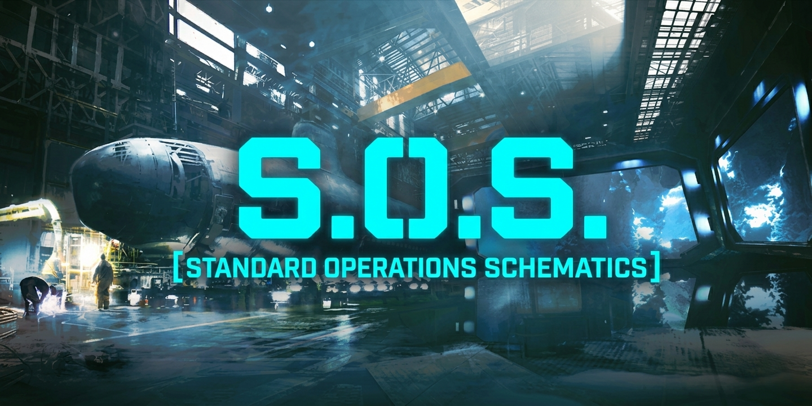

# S.O.S. - Standard Operations Schematics

**S.O.S.** is a high-performance recipe browser and material tracking utility for **Barotrauma**. Designed to be the ultimate companion for both vanilla and heavily modded campaigns (like Neurotrauma or BaroCraftables), it provides a seamless, integrated interface to explore the complex economy of Europa.

## Key Features
- **Comprehensive Browser:** View Fabrication, Deconstruction, and "Used In" recipes for any item in the game.
- **HUD Tracker:** Track ingredients in real-time with an on-screen checklist that updates as you gather materials.
- **Dynamic Meta-Info:** View base prices, item tags, stack sizes, and detailed descriptions in a structured Wiki-style panel.
- **Favorites System:** Pin your most-used items to the top of the search results for instant access.
- **Smart Navigation:** Web-browser style history (Back/Forward) with full keyboard and mouse shortcut support.
- **Multi-language:** Native support for English and Spanish

## Controls
- **[J]**: Open / Close the SOS Menu.
- **[Backspace]** or **[Mouse 4]**: Navigate to previous item.
- **[Ctrl + Backspace]** or **[Mouse 5]**: Navigate to next item.
- **[Left Click]**: Select item / Navigate to ingredient.
- **[Right Click]**: Open context menu (Track item, Toggle Favorite, etc.).
- **[Escape]**: Close window.

## Project Status: Beta

**S.O.S.** is currently in its Beta stage. While the core functionality is stable and high-performing, we are working towards deep integration with the game's mechanics and immersion. 

### Roadmap: The Neural Link System
In future updates, access to the S.O.S. interface will be gated behind a **Chip Progression System**. Players will need to craft and consume specialized neural chips to unlock different modules of the database.

#### Tiered Modules
- **Fabricator Chip (Lv. 1):** Unlocks the ability to view crafting recipes (Compatible with vanilla and modded stations).
- **Fabricator Chip (Lv. 2):** Unlocks "Reverse Lookup" (View what items can be crafted using the selected material).
- **Deconstructor Chip (Lv. 1):** Unlocks deconstruction yield data.
- **Deconstructor Chip (Lv. 2):** Unlocks "Reverse Deconstruction" (View which items provide this material when recycled).
- **Medical Chip (Lv. 1 & 2):** Specialized modules for medical recipes and advanced chemistry.

#### Crafting & Acquisition
- **Base Components:** Crafting will require **FPGA Circuits**, **Steel**, **Plastic**, and a new **Basic Data Chip** (found in wrecks or crafted).
- **Advanced Chips:** Level 2 modules will require an **Advanced Data Chip**, rare loot found only in high-risk zones or complex recipes.
- **Specialization:** You can cross-grade modules; for example, a **Deconstructor Chip** can be obtained by recycling a Fabricator or Medical chip.

---
*Stay tuned for these updates as we move toward the 1.0 Full Release.*

## License & Copyright
This project is licensed under the [S.O.S. Custom Permissive License (SCPL)](LICENCE).

### Key Terms:
- **Personal Use:** You are free to use, modify, and study the code for personal purposes.
- **Attribution:** Redistribution on third-party sites or GitHub is allowed provided that full credit is given to the author (@Retype15) and a link to the original repository is included.
- **⚠️ Exclusive Distribution:** The Author reserves the **sole and exclusive right** to publish and manage this Software on the **Steam Workshop**. Re-uploading this mod to the Workshop by anyone other than @Retype15 is strictly prohibited and will result in a DMCA notice.
- **Non-Commercial:** This mod cannot be sold or included in any paid services/paywalls.

---
*Developed by [@Retype15](https://github.com/Retype15)*